# ChatGPT PRO — полный курс на русском

<p align="center">
  
</p>

> **ChatGPT PRO** — бесплатный практический курс на русском о том, как превратить ChatGPT из «умного поисковика» в рабочий инструмент, который экономит часы каждую неделю. Подходит и новичкам, и тем, кто давно пользуется ChatGPT, но чувствует, что берёт от него лишь малую часть возможностей.
>
> **Что вы освоите:**
>
> - 🧠 **как устроены языковые модели** — токены, контекст, галлюцинации — и почему одни промпты работают, а другие нет;
> - ✍️ **промптинг** — от формулы «роль → задача → контекст → формат → ограничения» до цепочек промптов, структурированного вывода и мета-промптов;
> - 📁 **персонализацию, память и проекты** — чтобы ChatGPT знал ваш контекст и не приходилось объяснять всё заново;
> - 📊 **работу с данными и документами** — анализ таблиц, графики, разбор PDF, поиск и Deep Research с проверяемыми источниками;
> - 🤖 **Custom GPTs, коннекторы и агентов**, которые сами выполняют многошаговые задачи в сайтах и приложениях;
> - 💻 **Codex и OpenAI API** — для разработчиков и автоматизации процессов;
> - 🛡 **безопасность** — приватность данных, промпт-инъекции, проверка фактов.
>
> **Внутри:** теория простым языком, 13 модулей с практикой, 10 лабораторных, итоговый проект, лучшие практики и 10 золотых правил, 15 готовых рецептов, 14 цветных схем, антипаттерны, шпаргалка и самопроверка — всё в одном README. А ещё — **[практикум в файлах](practice/README.md)**: 13 практик с разбором «плохой → хороший промпт», учебные данные для отработки, ответы для самопроверки и **[50 лучших промптов](practice/best-prompts.md)**.
>
> 🧠 **[Machine learning](https://t.me/+PwIsGaFpgjhkNTdi)** — здесь можно найти полный список самых крутых ИИ курсов, чтобы стать гуру ИИ и множество полезных инструментов и уроками работы с ними, абсолютных мастхев!


---

## Что полезного в репозитории

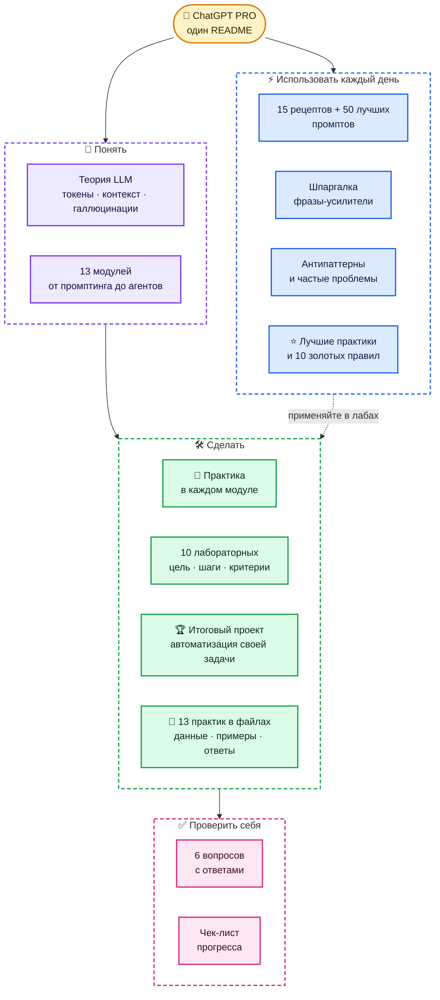

**Как проходить:** теория → модуль → практика из модуля → лаба. Рецепты и шпаргалку держите под рукой с первого дня.

## Содержание

| Старт | Курс | Практика | Справочник |
|---|---|---|---|
| [Быстрый старт](#быстрый-старт-за-5-минут) | [Как устроен ChatGPT](#как-устроен-chatgpt) | [Рецепты задач](#практические-рецепты-задач) | [Шпаргалка](#шпаргалка) |
| [Карта возможностей](#карта-возможностей) | [Маршрут обучения](#маршрут-обучения) | [Антипаттерны](#антипаттерны-и-как-их-исправить) | [Частые проблемы](#частые-проблемы) |
| [Для кого](#для-кого) | [13 модулей](#модуль-1-модели-и-режимы) | [Практикум: 10 лаб](#практикум-10-лабораторных) | [Полезные ссылки](#полезные-ссылки) |
| [Лучшие практики](#лучшие-практики) · [Теория LLM](#теория-как-работает-языковая-модель) | [Продвинутый промптинг](#продвинутые-техники-промптинга) | [Итоговый проект](#итоговый-проект) | [Проверь себя](#проверь-себя) · [Прогресс](#прогресс) |
| [🧪 Практикум в файлах](practice/README.md) | [📂 Учебные данные](practice/README.md#учебные-файлы) | [13 практик с примерами](#практикум-в-файлах-13-практик-с-примерами) | [🏆 50 лучших промптов](practice/best-prompts.md) |

## Полезные ресурсы
- 🧠 **[Machine learning](https://t.me/+PwIsGaFpgjhkNTdi)** — ИИ-инструменты для генерации Python кода, умные-агенты и все что нужно знать из области AI.
- 🖥 **[Pythonl](https://t.me/+pwTlhtK8vEY4Mjky)**— с помощью понятных картинок и коротких видео авторы объясняют сложные концепции и учат профессиональному подходу в разработке.
- 🖥 **[Python Интервью](https://t.me/+sTT6sbZubDM2MWEy)** — огромное количество разобранных вопросов с реальных собеседований Python разработчика.
- 📖 **[PythonBooks](https://t.me/+VnfYvBmK_ZM3YzIy)** ([2](https://t.me/+8Dvl5VlUs5NhMTIy)) — мы создали канал с книгами по Linux и залили туда наверное самую большую подборку книг.
- 💼 **[Python Jobs](https://t.me/+eQsE0ZVnmINmNjQy)** — вакансии и подработка для Python разработчиков.
- 🔝 **[А здесь мы собрали](https://t.me/addlist/8vDUwYRGujRmZjFi)** целый кладезь полезных Python ресурсов для прокачки.
- 🔥 **[Больше крутых курсов и полезных ИИ-инструментов](https://t.me/ai_machinelearning_big_data/10997)** — регулярно публикую здесь.
- 📦 **[Harness_ru](https://github.com/justxor/Harness_ru)** — полный курс по Harness 2026 на русском языке: всё, что нужно знать, в одном месте.
- 🤖 **[Claude Code PRO](https://github.com/justxor/claude-code-pro-course)** — полный курс по Claude Code на русском: CLAUDE.md, skills, subagents, hooks, MCP, CI.

## Для кого

- Тем, кто пользуется ChatGPT «как поисковиком» и хочет получать в разы больше пользы.
- Специалистам: маркетологам, аналитикам, менеджерам, юристам, преподавателям — всем, кто работает с текстом и данными.
- Разработчикам, которым нужны Codex, API и автоматизация.
- Командам, которые хотят внедрить ChatGPT в процессы безопасно и системно.

## Быстрый старт за 5 минут

1. **Настройте персонализацию** (*Settings → Personalization*): кто вы, чем занимаетесь, каким должен быть ответ.
2. **Создайте проект** под постоянную задачу (работа, учёба, хобби) и загрузите туда ключевые файлы.
3. **Выберите режим**: быстрый — для простых вопросов, думающий (reasoning) — для анализа, кода и сложных решений.
4. **Пишите промпт по формуле**:

```text
Роль:      Ты — опытный аналитик маркетплейсов.
Задача:    Сравни три ниши для старта продаж.
Контекст:  Бюджет 300 тыс. ₽, склад в Казани, опыта продаж нет.
Формат:    Таблица: ниша · спрос · конкуренция · маржа · риски. Потом вывод в 3 пунктах.
Ограничения: Только проверяемые факты, источники — ссылками. Если данных нет — так и скажи.
```

5. **Итерируйте**: «углуби пункт 2», «сократи вдвое», «найди слабые места в своём ответе».

## Как устроен ChatGPT

ChatGPT собирает **контекст** из нескольких источников, выбирает **инструменты** и только потом отвечает. Чем лучше контекст — тем точнее результат.

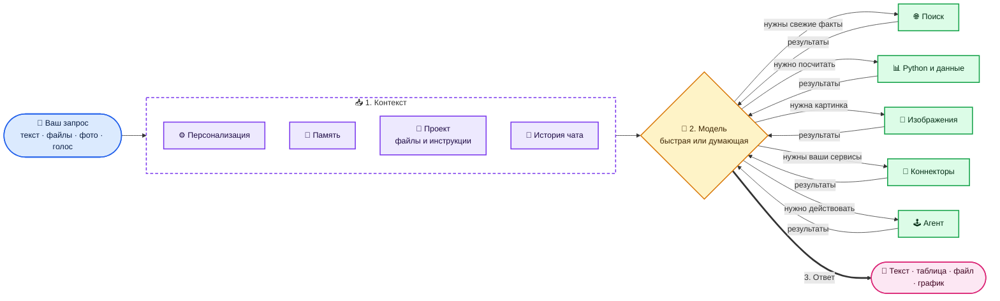

### Окно контекста — главный ресурс

Модель «помнит» только то, что поместилось в контекст текущего чата (плюс память и инструкции). Длинный чат с десятком тем — источник путаницы и ошибок.

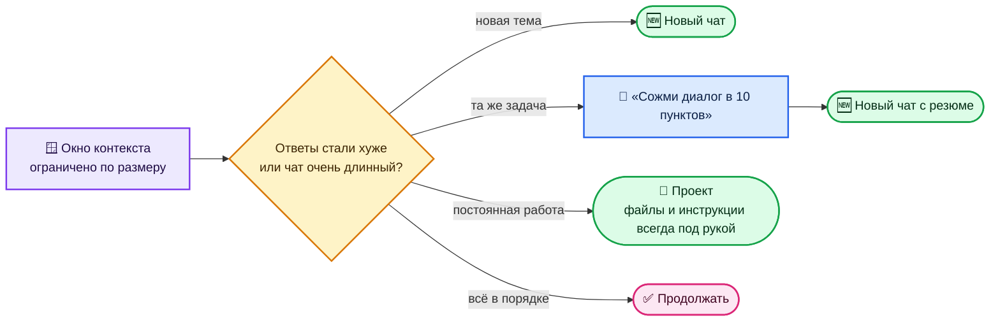

## Теория: как работает языковая модель

Чтобы управлять ChatGPT, а не «угадывать», полезно понимать 6 идей.

### 1. Токены

Модель видит текст не буквами и не словами, а **токенами** — кусочками слов. В русском тексте токенов обычно больше, чем в английском того же смысла. Лимиты контекста, длины ответа и стоимость API считаются в токенах.

### 2. Предсказание следующего токена

Языковая модель — это очень большая функция, которая по всему контексту предсказывает **вероятности следующего токена**, выбирает один, добавляет его к тексту и повторяет.

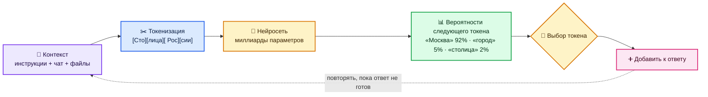

Отсюда три практических вывода:

- **Контекст решает всё.** Модель продолжает то, что видит. Дали роль, примеры и формат — получили продолжение «в том же духе».
- **Ответы вариативны.** Один и тот же вопрос может дать разные ответы — перегенерируйте и выбирайте лучший.
- **Модель пишет правдоподобное, а не обязательно истинное.** Так появляются галлюцинации.

### 3. Обучение: откуда модель «знает»

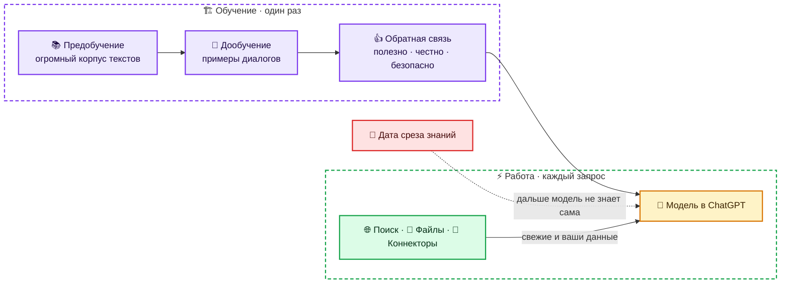

У модели есть **дата среза знаний**: о событиях позже неё она знает только из поиска, ваших файлов и коннекторов. Для всего, что меняется (цены, законы, версии, новости), — включайте поиск или давайте источник.

### 4. Почему возникают галлюцинации

| Причина | Как снизить риск |
|---|---|
| вопрос о редком или свежем факте | включить поиск, дать документ |
| просьба «назови 10 исследований» без источников | просить только найденное со ссылками |
| слишком общий промпт | контекст, рамки, «если не знаешь — скажи» |
| длинный запутанный чат | новый чат с кратким резюме |
| расчёты «в уме» | анализ данных: пусть считает кодом |

### 5. Быстрые и думающие модели

Думающая (reasoning) модель перед ответом строит внутреннюю цепочку рассуждений: пробует варианты, проверяет себя. Это дольше, но заметно лучше на задачах с логикой, кодом, математикой и планированием. Для простых вопросов это лишнее ожидание.

### 6. Чего модель не умеет «из коробки»

| Ограничение | Обходной путь |
|---|---|
| не знает ваших данных | файлы, проекты, коннекторы |
| не помнит прошлые чаты полностью | память, инструкции проекта, резюме |
| ошибается в точных расчётах в тексте | анализ данных с кодом |
| не видит, что происходит «сейчас» | поиск, агент |
| не несёт ответственности за решения | финальное решение — за человеком |

## Карта возможностей

| Хочу… | Инструмент |
|---|---|
| быстрый ответ, перевод, переписать текст | обычный чат, быстрая модель |
| разобрать сложную задачу, код, математику, стратегию | думающая (reasoning) модель |
| чтобы ChatGPT всегда знал, кто я и как отвечать | персонализация и память |
| вести постоянную задачу с файлами | **проекты** |
| свежие факты со ссылками | поиск |
| большой отчёт по десяткам источников | **Deep Research** |
| посчитать, построить график, почистить таблицу | анализ данных (файлы + Python) |
| писать и редактировать длинный текст или код | Canvas / документы |
| картинку, обложку, инфографику | генерация изображений |
| своего ассистента с инструкциями и базой знаний | **Custom GPT** |
| работу с почтой, диском, календарём, CRM | коннекторы и приложения |
| чтобы ChatGPT сам выполнил многошаговое действие | **агентный режим** |
| писать и ревьюить код в репозитории | **Codex** |
| встроить модель в свой продукт | OpenAI API |

## Маршрут обучения

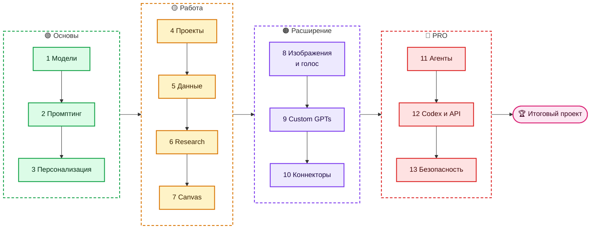

---

## Модуль 1. Модели и режимы

В ChatGPT обычно есть **быстрые** модели (мгновенный ответ) и **думающие** (reasoning: модель сначала рассуждает, потом отвечает). Названия и лимиты меняются часто — актуальный список смотрите в выборе модели и в [release notes](https://help.openai.com/en/articles/6825453-chatgpt-release-notes).

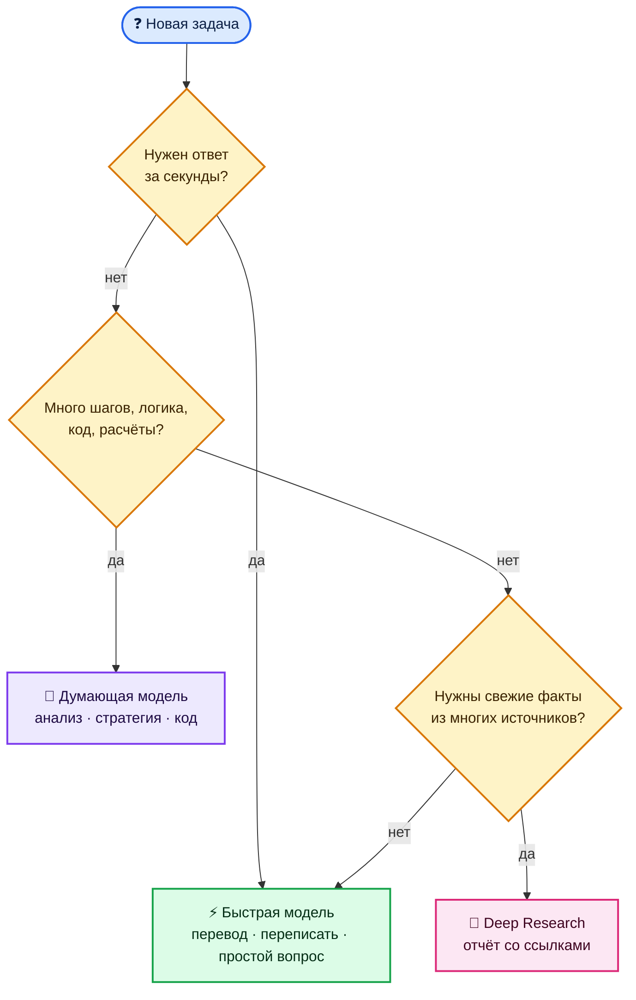

**Практика:** задайте одну и ту же сложную задачу быстрой и думающей модели и сравните глубину ответа и время.

## Модуль 2. Промптинг

**Формула:** роль + задача + контекст + формат + ограничения + примеры.

| ❌ Размыто | ✅ Конкретно |
|---|---|
| «Напиши пост про наш продукт» | «Пост для Telegram, 600 знаков, для владельцев кофеен. Продукт — касса с учётом остатков. Тон — дружеский, без канцелярита. В конце — вопрос к аудитории. Дай 3 варианта.» |
| «Сделай резюме документа» | «Сожми договор до 10 пунктов: стороны, сроки, деньги, штрафы, риски для нас. Риски отметь ⚠️. Цитируй номер пункта.» |
| «Помоги с Excel» | «В файле продажи по дням. Найди 3 главных тренда, построй график по неделям, выдели аномалии. Объясни, как считал.» |

**Приёмы, которые работают:**

- **Примеры (few-shot):** покажите 1–3 образца желаемого результата — это сильнее любых описаний.
- **Разметка:** отделяйте данные от инструкций — `"""текст"""`, `<документ>…</документ>`, заголовки.
- **Пусть спросит:** «Прежде чем отвечать, задай мне до 5 уточняющих вопросов».
- **Самопроверка:** «Найди 3 слабых места в своём ответе и исправь их».
- **Декомпозиция:** большую задачу — по шагам в разных сообщениях: план → черновик → правка.
- **Роль критика:** «Ты — придирчивый редактор/инвестор/юрист. Разнеси этот текст».
- **Шаблоны:** сохраняйте удачные промпты — в проектах, Custom GPT или заметках.

### Продвинутые техники промптинга

**Цепочка промптов.** Сложную задачу разбивайте на этапы, где выход одного — вход следующего:

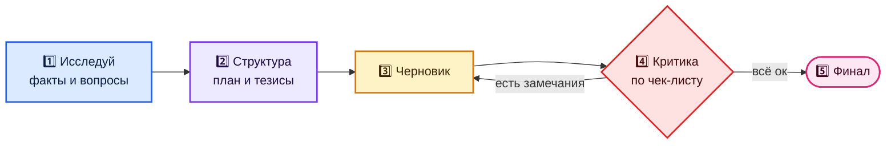

**Структурированный вывод.** Когда результат пойдёт в таблицу или код — просите строгий формат:

```text
Извлеки из отзывов ниже данные и верни ТОЛЬКО JSON-массив без пояснений:
[{"товар": "...", "оценка": 1-5, "плюсы": ["..."], "минусы": ["..."], "тон": "позитив|нейтрал|негатив"}]
"""
<отзывы>
"""
```

**Мета-промпт.** Пусть ChatGPT сам напишет промпт:

```text
Я хочу регулярно получать от тебя [результат]. Задай мне вопросы,
чтобы понять задачу, а потом напиши идеальный промпт для этого —
с ролью, контекстом, форматом и ограничениями.
```

**Оценка по рубрике.** Дайте критерии — и ответ станет проверяемым:

```text
Оцени текст по шкале 1–10 по критериям: ясность, польза для читателя,
структура, убедительность, грамотность. Для каждого — почему такая оценка
и одно конкретное улучшение. Затем перепиши текст с учётом всех улучшений.
```

**Дебаты.** «Сыграй двух экспертов с противоположными позициями по [вопрос], 3 раунда аргументов, потом нейтральный вывод». Помогает увидеть слепые зоны.

**Обратный промпт.** Покажите удачный образец: «Вот текст, который мне нравится. Опиши его стиль, структуру и приёмы так, чтобы по этому описанию можно было писать похожие тексты».

**🧪 Практика:** Возьмите свою реальную задачу и напишите промпт тремя способами: одной фразой, по формуле и по формуле + 2 примера. Сравните ответы и сохраните лучший промпт как шаблон.

## Модуль 3. Персонализация и память

| Механизм | Что хранит | Когда использовать |
|---|---|---|
| **Персонализация** (custom instructions) | кто вы и как отвечать — для всех чатов | стиль, язык, формат, профессия |
| **Память** | факты, которые ChatGPT запомнил из диалогов | предпочтения, контекст о вас и проектах |
| **Инструкции проекта** | правила только для чатов этого проекта | клиент, продукт, курс, исследование |
| **Временный чат** | ничего не запоминает | чувствительные или разовые вопросы |

Пример персонализации:

```text
Я продакт-менеджер в B2B SaaS. Отвечай по-русски, коротко и по делу.
Сначала вывод, потом детали. Таблицы — где сравнение.
Не выдумывай факты: если не уверен — скажи и предложи, как проверить.
Без воды, извинений и фраз «отличный вопрос».
```

**Совет:** периодически открывайте *Settings → Personalization → Memory* и удаляйте устаревшее — неверная память портит ответы.

**🧪 Практика:** Заполните персонализацию по шаблону выше, затем задайте 3 вопроса из своей работы — до и после настройки. Откройте память и удалите всё лишнее.

## Модуль 4. Проекты

Проект — это папка с чатами, файлами и своими инструкциями. Всё, что лежит в проекте, ChatGPT учитывает в каждом его чате.

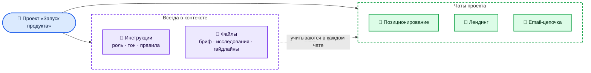

**Правило:** одна постоянная задача — один проект. Разовые вопросы — в обычном чате.

**🧪 Практика:** Создайте проект под свою постоянную задачу: инструкции (5–7 строк) + 2–3 файла. Проведите в нём 3 разных чата и убедитесь, что ChatGPT учитывает файлы без напоминаний.

## Модуль 5. Файлы и анализ данных

ChatGPT умеет читать PDF, документы, таблицы, изображения и запускать Python для расчётов и графиков.

- Загружайте CSV/XLSX и просите: «опиши структуру данных», «найди аномалии», «построй график», «сделай сводную таблицу».
- Просите **показать код и шаги** — так легче проверить расчёт.
- Результат можно скачать: очищенную таблицу, график, отчёт.
- Для больших PDF: сначала «сделай оглавление», потом вопросы по разделам.

```text
[прикреплён файл sales_2026.xlsx]
1) Опиши колонки и проверь данные на пропуски и дубли.
2) Посчитай выручку по месяцам и категориям, построй график.
3) Найди 3 инсайта и 2 аномалии. Для каждого — как проверить.
4) Отдай очищенный файл и график PNG.
```

**🧪 Практика:** Загрузите любую свою таблицу (или скачайте открытый датасет), выполните промпт из модуля, а затем проверьте один из расчётов вручную или по показанному коду.

## Модуль 6. Поиск и Deep Research

| | Поиск | Deep Research |
|---|---|---|
| Время | секунды | минуты |
| Источники | несколько | десятки, с анализом |
| Результат | ответ со ссылками | структурированный отчёт |
| Когда | факты, новости, цены | рынок, конкуренты, обзор литературы, due diligence |

Хороший запрос для Deep Research: **вопрос + рамки + формат отчёта + критерии источников**:

```text
Исследуй рынок онлайн-школ программирования в России за 2024–2026.
Нужно: размер рынка, топ-10 игроков, модели монетизации, средний чек, тренды.
Источники: отчёты аналитиков, публичная отчётность, СМИ. Без блогов-однодневок.
Формат: отчёт с таблицами и ссылками, в конце — 5 возможностей для нового игрока.
```

**Всегда проверяйте ключевые цифры по ссылкам** — модель может ошибиться в интерпретации.

**🧪 Практика:** Задайте один и тот же вопрос о рынке обычным поиском и через Deep Research. Сравните глубину и проверьте 3 цифры из отчёта по ссылкам.

## Модуль 7. Canvas и работа с документами

Canvas (и совместные документы) — редактор рядом с чатом: текст или код открываются отдельно, их можно править точечно.

- Выделите фрагмент → «перепиши проще», «добавь пример», «проверь факты».
- Просите правки уровнем: «сократи на 30%», «сделай тон официальнее», «адаптируй для школьников».
- Для кода — «добавь комментарии», «найди баги», «переведи на другой язык».

**🧪 Практика:** Напишите в Canvas текст на 1 страницу и доведите его до финала только точечными правками выделенных фрагментов — без перегенерации целиком.

## Модуль 8. Изображения и голос

**Изображения.** Описывайте как арт-директор: объект, композиция, стиль, свет, палитра, формат, текст на картинке.

```text
Обложка для YouTube 16:9: разработчик за ноутбуком, неоновая подсветка,
крупная надпись «ChatGPT за 10 минут», контрастные цвета, без мелких деталей.
```

Правки — итеративно: «то же, но фон светлее», «убери текст», «сделай в стиле плоской иллюстрации».

**Голос.** Удобен для практики языков, собеседований, мозговых штурмов на ходу. Приём: «Проведи со мной mock-интервью на позицию Python-разработчика, задавай по одному вопросу и давай фидбек».

**🧪 Практика:** Сделайте обложку для поста за 3 итерации: черновик → правка композиции → правка стиля. Запишите, какие формулировки сработали лучше всего.

## Модуль 9. Custom GPTs

Custom GPT — ваш ассистент с инструкциями, файлами знаний и (опционально) действиями через API.

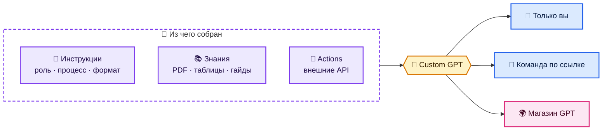

**Шаблон инструкций:**

```text
Ты — ассистент отдела продаж компании X.
Задача: готовить коммерческие предложения по брифу клиента.
Процесс:
1. Если в брифе не хватает данных — задай уточняющие вопросы (не больше 5).
2. Используй цены и кейсы только из файлов знаний. Ничего не выдумывай.
3. Структура КП: проблема клиента → решение → кейс → цена → следующий шаг.
Формат: деловой тон, до 1 страницы, без жаргона.
```

**🧪 Практика:** Соберите Custom GPT для одной своей рутинной задачи: инструкции по шаблону + файл знаний. Проверьте его на 5 тестовых запросах, включая «каверзный», где данных нет.

## Модуль 10. Коннекторы и приложения

Коннекторы подключают ChatGPT к вашим данным и сервисам: облачные диски, почта, календарь, CRM, таск-трекеры и другие. Набор зависит от тарифа и региона.

- «Найди в моём Google Drive последнюю версию договора с X и выпиши сроки».
- «Собери из почты за неделю все письма от клиентов с жалобами и сгруппируй по темам».
- **Подключайте только нужное** и проверяйте, какие данные доступны ChatGPT.

**🧪 Практика:** Подключите один коннектор (диск или почту) и решите с ним задачу поиска информации. Затем проверьте в настройках, какие доступы выданы, и отключите лишнее.

## Модуль 11. Агенты

Агентный режим даёт ChatGPT свой «компьютер»: он сам открывает сайты, кликает, заполняет формы, работает с файлами и приложениями, а вы наблюдаете и подтверждаете важные шаги. В 2026 году OpenAI развивает это направление и в виде долгоживущих агентов, которые ведут работу между чатами — смотрите актуальные возможности в release notes.

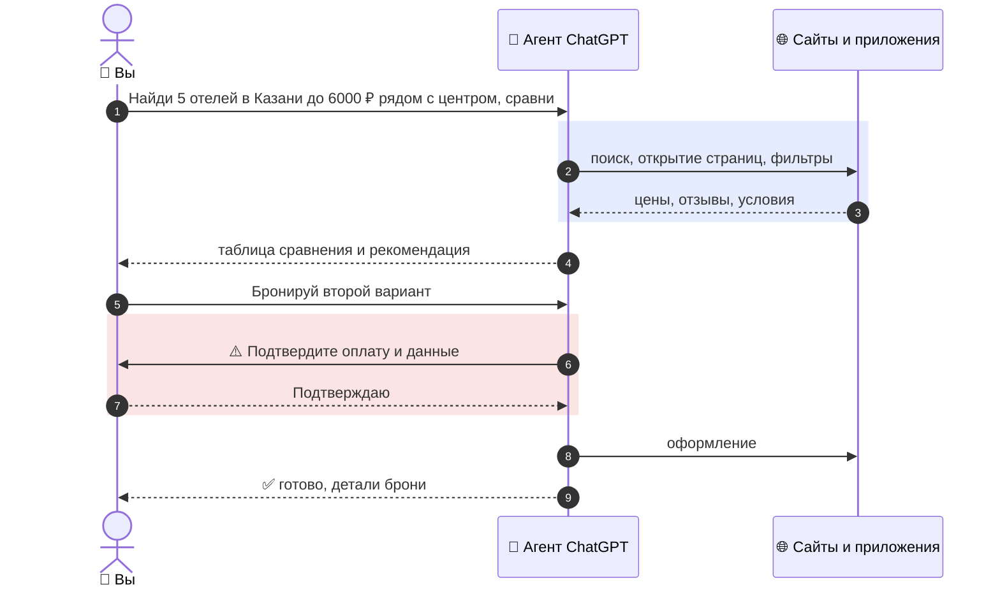

**Правила работы с агентом:**

- ставьте задачу с критериями успеха и ограничениями (бюджет, сроки, «ничего не покупать без подтверждения»);
- следите за важными шагами: оплата, отправка писем, удаление;
- не давайте агенту доступ к тому, что не нужно для задачи;
- помните о промпт-инъекциях: текст на сайтах — это данные, а не команды.

**🧪 Практика:** Дайте агенту безопасную задачу без покупок: найти и сравнить 5 вариантов (курсы, отели, инструменты) по 4 критериям. Понаблюдайте, где он ошибается, и уточните задачу.

## Модуль 12. Codex и API для разработчиков

**Codex** — агент для программирования: читает репозиторий, пишет код, запускает тесты, делает ревью и готовит PR. Работает в облаке, в IDE и в терминале.

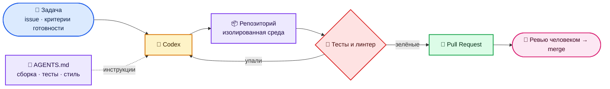

Советы:

- держите в репозитории `AGENTS.md`: как собрать, как тестировать, стиль кода — Codex читает его как инструкцию;
- формулируйте задачу как хороший issue: что, где, критерии готовности;
- запускайте несколько вариантов решения и выбирайте лучший;
- **всегда ревьюйте diff** перед мержем.

**OpenAI API** — для встраивания моделей в свои продукты:

```python
from openai import OpenAI

client = OpenAI()  # ключ берётся из переменной окружения OPENAI_API_KEY
response = client.responses.create(
    model="<актуальная-модель>",  # список моделей: platform.openai.com/docs/models
    input="Сделай краткое резюме: ..."
)
print(response.output_text)
```

**🧪 Практика:** Попросите Codex (или обычный чат) написать небольшой скрипт с тестами, затем запустите тесты сами и попросите исправить падения. Для API — выполните пример из модуля со своим промптом.

## Модуль 13. Безопасность и приватность

- **Не загружайте** пароли, ключи API, паспортные данные, коммерческую тайну без разрешения компании.
- Для чувствительных разговоров — **временный чат**; проверьте настройки использования данных для обучения (*Settings → Data controls*).
- Для команд — бизнес-тарифы с админкой и политиками данных.
- **Проверяйте факты**: модель может уверенно ошибаться. Цифры, законы, медицина, финансы — только с проверкой по первоисточнику.
- **Промпт-инъекции**: файлы, письма и сайты могут содержать скрытые «инструкции» для модели. Особенно важно для агентов и коннекторов.
- Решения с последствиями (деньги, здоровье, право) — принимает человек.

**🧪 Практика:** Проведите аудит: какие данные вы уже загружали в ChatGPT, включена ли память, какие коннекторы подключены. Составьте себе 5 правил «что нельзя загружать».

---

## Лучшие практики

Главный принцип: **ChatGPT — сильный стажёр, а не оракул.** Он быстро делает черновики, анализ и варианты, но цель, контекст, проверка и решение — за вами.

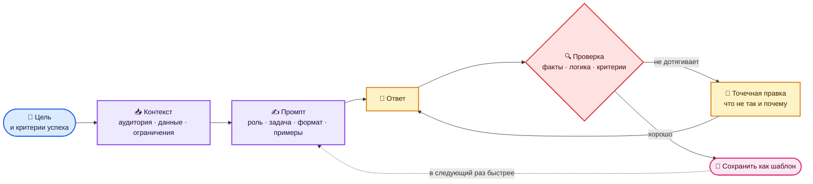

### 1. До запроса

- **Сформулируйте критерий успеха.** «Хороший ответ — это… » Если вы сами не знаете, каким должен быть результат, модель тоже не знает.
- **Дайте уникальный контекст** — то, что знаете только вы: аудитория, цель, ограничения, что уже пробовали и почему не сработало.
- **Примеры сильнее описаний.** Один образец желаемого текста или таблицы заменяет абзац объяснений.
- **Выберите режим под задачу:** быстрый — для простого, думающий — для сложного, поиск — для свежих фактов, Deep Research — для исследования.
- **Отделяйте данные от инструкций:** `"""…"""`, `<документ>…</документ>` или заголовки «Данные:» / «Задача:».

### 2. Во время диалога

- **Одна задача — один чат.** Если чат разросся — «сожми диалог в 10 пунктов» и продолжите в новом.
- **Правьте точечно, а не «переделай»:** «пункт 3 слабый — нет цифр, добавь пример из ритейла».
- **Пусть задаёт вопросы:** «прежде чем отвечать, задай до 5 уточняющих вопросов».
- **Разделяйте генерацию и отбор:** сначала 10 вариантов, потом оценка по вашим критериям, потом доработка лучшего.
- **Для важного — 2–3 перегенерации.** Ответы вариативны, лучший часто не первый.
- **Просите показать ход работы:** «объясни, как считал», «какие допущения ты сделал».

### 3. Проверка результата

- **Факты — по источникам, числа — кодом, цитаты — по оригиналу.**
- **Красная команда:** «найди 5 слабых мест и ошибок в этом ответе» — модель неплохо критикует сама себя.
- **Независимый рецензент:** вставьте результат в **новый** чат и попросите оценить по критериям — свежий контекст не «влюблён» в свой ответ.
- **Сверяйтесь с критерием успеха** из шага 1, а не с ощущением «звучит убедительно».
- **Решения с последствиями принимает человек.**

### 4. Системность: от разовых чатов к процессу

| Уровень | Что делать | Эффект |
|---|---|---|
| Привычка | библиотека из 10–20 личных промптов | минус рутина каждый день |
| Проекты | проект под каждую постоянную задачу | не нужно объяснять контекст заново |
| Ассистенты | Custom GPT для повторяемых процессов | результат стабилен, им могут пользоваться коллеги |
| Автоматизация | агенты, коннекторы, API | задачи выполняются без вас |
| Гигиена | раз в месяц — ревизия памяти, инструкций, доступов | ответы не портятся устаревшим контекстом |

**Замеряйте эффект:** засеките, сколько задача занимала до ChatGPT и после. Это лучший аргумент, где внедрять дальше.

### 5. Для команд и компаний

- Напишите **короткую политику**: какие данные можно загружать, какие нельзя, кто отвечает за проверку.
- Используйте **бизнес-тарифы** с админкой и контролем данных, а не личные аккаунты.
- Делайте **общие проекты и Custom GPT** под процессы: КП, ответы клиентам, онбординг.
- Назначьте **чемпионов** в отделах, которые собирают лучшие промпты и обучают коллег.
- Начинайте с задач, где **ошибка дешёвая, а экономия заметная**: черновики, саммари, анализ отзывов.

### 10 золотых правил

| # | Правило | Почему |
|---|---|---|
| 1 | Контекст важнее формулировки | модель продолжает то, что видит |
| 2 | Покажи пример | образец понятнее любого описания |
| 3 | Задай формат и объём | иначе получите «простыню» |
| 4 | Разрешай говорить «не знаю» | меньше галлюцинаций |
| 5 | Сложное — по шагам | меньше потерянных требований |
| 6 | Проверяй факты и числа | модель может уверенно ошибаться |
| 7 | Новый чат на новую тему | не смешивается контекст |
| 8 | Сохраняй удачные промпты | второй раз — в разы быстрее |
| 9 | Не загружай секреты | данные — ваша ответственность |
| 10 | Решение — за человеком | ответственность не делегируется |

### Чек-лист перед тем, как использовать результат

```markdown
- [ ] Ответ решает именно мою задачу и соответствует критерию успеха
- [ ] Ключевые факты и цифры проверены по источникам
- [ ] Расчёты сделаны кодом или перепроверены
- [ ] Нет выдуманных ссылок, цитат и имён
- [ ] Тон и формат подходят аудитории
- [ ] В тексте нет конфиденциальных данных
- [ ] Я готов(а) отвечать за этот результат как за свой
```

## Практикум в файлах: 13 практик с примерами

Отдельная папка [`practice/`](practice/README.md) — для тех, кто хочет не читать, а делать. В каждой практике: разбор «плохой → хороший промпт», готовые промпты для копирования, упражнения, критерии «готово» и ответы для самопроверки. Для отработки есть учебные файлы — таблица продаж с ошибками, договор с «ловушками», расшифровка встречи и отзывы клиентов.

| № | Практика | Что отработаете |
|---|---|---|
| 1 | [Формула промпта](practice/01-prompt-formula.md) | Роль → задача → контекст → формат → ограничения на примерах «до/после» |
| 2 | [Продвинутые техники](practice/02-advanced-prompting.md) | Few-shot, цепочки, JSON, самокритика, red team, мета-промпты |
| 3 | [Персонализация и проекты](practice/03-personalization-projects.md) | Готовые шаблоны инструкций под роли, память, проекты |
| 4 | [Анализ данных](practice/04-data-analysis.md) | Очистка, метрики, графики и проверка расчётов на `sales.csv` |
| 5 | [Документы и PDF](practice/05-documents-pdf.md) | Разбор договора, протокол встречи, сравнение версий |
| 6 | [Deep Research](practice/06-deep-research.md) | Бриф-шаблон, исследование рынка, фактчекинг, аудит источников |
| 7 | [Тексты и редактура](practice/07-writing-editing.md) | Паспорт стиля, анти-клише, один текст — пять форматов |
| 8 | [Работа и бизнес](practice/08-work-business.md) | Анализ отзывов, матрица решений, переговоры, регламенты |
| 9 | [Обучение](practice/09-learning.md) | Сократ, Фейнман, экзамен-тренажёр, карточки Anki |
| 10 | [Код, Codex и API](practice/10-coding-codex.md) | Скрипты, отладка, ревью, тикет для Codex, первый вызов API |
| 11 | [Custom GPTs и агенты](practice/11-custom-gpts-agents.md) | Шаблон инструкций GPT, тестирование, задачи для агента |
| 12 | [Изображения и голос](practice/12-images-voice.md) | Формула промпта для картинки, распознавание, голосовые сценарии |
| 13 | [Безопасность](practice/13-safety-fact-check.md) | Светофор данных, охота на галлюцинации, промпт-инъекции |
| ⭐ | [50 лучших промптов](practice/best-prompts.md) | Библиотека по 10 категориям + фразы-усилители |

## Практикум: 10 лабораторных

Каждая лаба — 20–60 минут. Делайте на **своих** задачах и данных: так навык закрепляется быстрее.

<details>
<summary><b>Лаба 1. Личный ассистент за 15 минут</b></summary>

**Цель:** настроить ChatGPT под себя.

**Шаги:**

1. Заполните персонализацию: роль, задачи, формат ответов, запреты.
2. Создайте проект «Работа» с инструкциями и 2 файлами.
3. Задайте 5 рабочих вопросов и оцените ответы по шкале 1–5.
4. Поправьте инструкции по слабым местам и повторите.

**Готово, если:** средняя оценка выросла, а ответы приходят в нужном формате без напоминаний.

</details>

<details>
<summary><b>Лаба 2. Библиотека промптов</b></summary>

**Цель:** собрать 10 личных шаблонов.

**Шаги:**

1. Выпишите 10 задач, которые вы делаете каждую неделю.
2. Для каждой напишите промпт по формуле, оставив §[переменные]§.
3. Проверьте каждый на реальных данных и доработайте.
4. Сохраните в заметки или в инструкции проекта.

**Готово, если:** каждый шаблон с первого раза даёт результат, который можно использовать почти без правок.

</details>

<details>
<summary><b>Лаба 3. Аналитика без Excel-магии</b></summary>

**Цель:** провести полный анализ таблицы.

**Шаги:**

1. Загрузите таблицу (продажи, расходы, трафик).
2. Попросите описать данные и найти проблемы качества.
3. Получите 3 графика и 5 инсайтов.
4. Проверьте 2 расчёта по коду, который показала модель.
5. Попросите итоговый отчёт для руководителя на 1 страницу.

**Готово, если:** есть очищенный файл, графики и отчёт, а цифры проверены.

</details>

<details>
<summary><b>Лаба 4. Исследование с источниками</b></summary>

**Цель:** научиться делать проверяемые исследования.

**Шаги:**

1. Сформулируйте вопрос по шаблону Deep Research из модуля 6.
2. Получите отчёт.
3. Выберите 5 ключевых утверждений и проверьте их по ссылкам.
4. Попросите модель отметить, какие выводы слабо подтверждены.

**Готово, если:** все ключевые цифры подтверждены источниками, слабые места явно отмечены.

</details>

<details>
<summary><b>Лаба 5. Контент-конвейер</b></summary>

**Цель:** выстроить цепочку промптов для контента.

**Шаги:**

1. Исследование темы и аудитории.
2. Контент-план на 2 недели.
3. Черновики 3 постов в Canvas.
4. Критика по рубрике и финальная редактура.
5. Иллюстрации к постам.

**Готово, если:** 3 готовых поста с иллюстрациями, и цепочку можно повторить на новой теме.

</details>

<details>
<summary><b>Лаба 6. Свой Custom GPT</b></summary>

**Цель:** упаковать экспертизу в ассистента.

**Шаги:**

1. Выберите задачу, которую часто объясняете другим.
2. Напишите инструкции: роль, процесс, формат, запреты.
3. Добавьте файлы знаний.
4. Составьте 10 тестовых запросов, включая провокационные.
5. Итерируйте инструкции, пока 9 из 10 ответов не будут хорошими.

**Готово, если:** коллега без объяснений получает от GPT полезный результат.

</details>

<details>
<summary><b>Лаба 7. Агент на безопасной задаче</b></summary>

**Цель:** научиться ставить задачи агенту.

**Шаги:**

1. Сформулируйте задачу: цель, критерии, ограничения, «ничего не покупать».
2. Запустите агента и наблюдайте за шагами.
3. Запишите, где он ошибся или застрял.
4. Переформулируйте задачу и запустите снова.

**Готово, если:** вторая попытка проходит без вашего вмешательства и даёт нужный результат.

</details>

<details>
<summary><b>Лаба 8. Разработка с Codex</b></summary>

**Цель:** пройти цикл «задача → PR».

**Шаги:**

1. Создайте тестовый репозиторий с §AGENTS.md§ (сборка, тесты, стиль).
2. Поставьте задачу как issue с критериями готовности.
3. Получите изменения и прогоните тесты.
4. Сделайте ревью diff и попросите исправить замечания.

**Готово, если:** изменения проходят тесты, а diff понятен и минимален.

</details>

<details>
<summary><b>Лаба 9. Проверка фактов</b></summary>

**Цель:** выработать привычку верификации.

**Шаги:**

1. Попросите ChatGPT без поиска рассказать о малоизвестной теме из вашей области.
2. Затем с поиском и ссылками.
3. Найдите расхождения и ошибки.
4. Сформулируйте для себя правило: когда обязательно включать поиск.

**Готово, если:** вы нашли хотя бы одну ошибку в ответе без поиска и понимаете почему.

</details>

<details>
<summary><b>Лаба 10. Автоматизация через API</b></summary>

**Цель:** встроить модель в скрипт.

**Шаги:**

1. Получите API-ключ на platform.openai.com и сохраните в переменной окружения.
2. Запустите пример из модуля 12.
3. Сделайте скрипт, который берёт CSV с отзывами и возвращает JSON с тональностью.
4. Проверьте результат на 20 строках вручную.

**Готово, если:** скрипт работает на всём файле, точность на выборке — не ниже 90%.

</details>

## Итоговый проект

Выберите один процесс из своей работы или учёбы, который занимает больше 2 часов в неделю, и автоматизируйте его с ChatGPT.

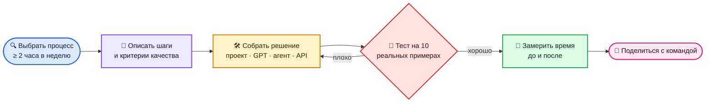

**Критерии:** процесс описан, решение воспроизводимо (промпты и инструкции сохранены), качество проверено на реальных примерах, экономия времени посчитана.

## Проверь себя

<details>
<summary><b>1. Почему один и тот же промпт даёт разные ответы?</b></summary>

Модель выбирает следующий токен из распределения вероятностей, поэтому результат вариативен. Можно перегенерировать ответ и выбрать лучший или жёстче задать формат.

</details>

<details>
<summary><b>2. Когда выбирать думающую модель, а когда быструю?</b></summary>

Думающую — для многошаговой логики, кода, математики, планирования и анализа. Быструю — для простых вопросов, переписывания и перевода.

</details>

<details>
<summary><b>3. Чем память отличается от инструкций проекта?</b></summary>

Память — факты о вас для всех чатов. Инструкции проекта действуют только внутри одного проекта и задают правила для конкретной задачи.

</details>

<details>
<summary><b>4. Как снизить риск галлюцинаций?</b></summary>

Включить поиск или дать источник, просить ссылки и цитаты, разрешить отвечать «не знаю», считать через анализ данных, держать чат коротким.

</details>

<details>
<summary><b>5. Что такое промпт-инъекция и почему это важно для агентов?</b></summary>

Это скрытые инструкции в сайте, письме или файле, которые пытаются заставить модель сделать не то, что хотели вы. Агент действует от вашего имени, поэтому важные шаги нужно подтверждать, а лишние доступы не выдавать.

</details>

<details>
<summary><b>6. Когда нужен Custom GPT, а когда достаточно проекта?</b></summary>

Проект — для вашей личной постоянной работы. Custom GPT — когда тот же сценарий нужен другим людям или нужен отдельный ассистент с собственными инструкциями, знаниями и действиями.

</details>

## Практические рецепты задач

Готовые промпты — копируйте и подставляйте своё в `[квадратные скобки]`.

<details>
<summary><b>📧 Деловое письмо</b></summary>

```text
Напиши письмо поставщику: поставка задержана на 2 недели, нам нужна
компенсация или ускорение. Тон — твёрдый, но вежливый. 150 слов.
Дай 2 варианта: мягкий и жёсткий.
```

</details>

<details>
<summary><b>📄 Разбор договора</b></summary>

```text
[прикреплён договор] Выдели: стороны, предмет, сроки, деньги, штрафы,
условия расторжения. Отдельно — 5 рисков для нас со ссылкой на пункт.
Это не юридическая консультация — отметь, что стоит проверить юристу.
```

</details>

<details>
<summary><b>📊 Анализ таблицы</b></summary>

```text
[прикреплён файл] Опиши данные, почисти дубли и пропуски,
посчитай ключевые метрики по месяцам, построй 2 графика.
В конце — 3 вывода для руководителя простым языком.
```

</details>

<details>
<summary><b>🎯 Стратегия и решения</b></summary>

```text
Я выбираю между A и B: [описание]. Составь таблицу: плюсы, минусы,
риски, стоимость, обратимость. Затем выступи адвокатом дьявола для
каждого варианта. В конце — какие данные помогли бы решить точнее.
```

</details>

<details>
<summary><b>📚 Изучить новую тему</b></summary>

```text
Объясни [тема] так, чтобы я понял за 20 минут.
Сначала аналогия из жизни, потом суть, потом 3 частые ошибки.
В конце — 5 вопросов, чтобы проверить себя. Отвечать буду по одному.
```

</details>

<details>
<summary><b>🗣 Подготовка к собеседованию</b></summary>

```text
Вот вакансия: [текст]. Вот моё резюме: [текст].
Проведи mock-интервью: по одному вопросу, после ответа — оценка 1–10
и как ответить сильнее. 8 вопросов: hard, soft, кейс.
```

</details>

<details>
<summary><b>✍️ Контент-план</b></summary>

```text
Сделай контент-план Telegram-канала про [ниша] на 4 недели, 3 поста в неделю.
Таблица: дата · тема · формат · хук · цель (охват/доверие/продажа).
Учти, что аудитория — [описание].
```

</details>

<details>
<summary><b>🔎 Конкурентный анализ</b></summary>

```text
Deep Research: сравни 5 главных конкурентов [продукт] в [регион].
Цены, ключевые функции, позиционирование, отзывы, слабые места.
Таблица + 5 идей, как нам отстроиться. Все факты — со ссылками.
```

</details>

<details>
<summary><b>🧑‍💻 Разбор ошибки в коде</b></summary>

```text
Вот код и ошибка: [код] [трейсбек].
1) Объясни причину простыми словами.
2) Дай минимальное исправление.
3) Подскажи, как написать тест, чтобы это не повторилось.
```

</details>

<details>
<summary><b>🛒 Описание товара</b></summary>

```text
Сделай описание товара для маркетплейса: [характеристики].
Заголовок до 60 символов с ключевыми словами, 5 буллетов выгод,
описание 800 знаков, без запрещённых площадкой слов. Дай 2 варианта.
```

</details>

<details>
<summary><b>🗂 Протокол встречи</b></summary>

```text
[расшифровка встречи] Сделай протокол: решения, задачи
(кто · что · срок), открытые вопросы. Затем — короткое письмо участникам
с итогами.
```

</details>

<details>
<summary><b>🌍 Перевод с адаптацией</b></summary>

```text
Переведи текст на английский для американской аудитории.
Не дословно: адаптируй идиомы, примеры и тон под маркетинговый лендинг.
Отдельно перечисли места, где пришлось сильно отойти от оригинала.
```

</details>

<details>
<summary><b>🧮 Финансовая модель</b></summary>

```text
Помоги собрать юнит-экономику для [бизнес]: CAC, LTV, маржа,
точка безубыточности. Задай вопросы о недостающих цифрах,
потом посчитай в таблице и отдай XLSX. Покажи формулы.
```

</details>

<details>
<summary><b>🎨 Визуал для поста</b></summary>

```text
Сгенерируй иллюстрацию к посту про [тема]: минимализм, 2–3 цвета
бренда [цвета], формат 1:1, без текста на картинке.
Дай 3 разных концепции на выбор.
```

</details>

<details>
<summary><b>🧠 Мозговой штурм</b></summary>

```text
Придумай 20 идей [задача]. Затем оцени каждую по шкале
влияние × простота, выбери топ-3 и распиши для них первые шаги
на неделю.
```

</details>

## Антипаттерны и как их исправить

| ❌ Ошибка | Почему плохо | ✅ Как правильно |
|---|---|---|
| Один бесконечный чат на все темы | контекст смешивается, качество падает | новый чат на тему, проекты для постоянных задач |
| «Напиши что-нибудь про…» | получаете средний шаблонный текст | формула: роль, задача, контекст, формат, ограничения |
| Принимать цифры и факты на веру | модель может ошибаться уверенно | просить источники и проверять ключевое |
| Переписывать промпт с нуля после неудачи | теряется найденное | итерировать: «что не так в ответе» и точечные правки |
| Всё в одном огромном промпте | модель теряет часть требований | декомпозиция: план → черновик → правка |
| Загружать секреты и персональные данные | риски утечки и нарушения политик | обезличивать, временный чат, бизнес-тариф |
| Агенту — «сделай всё сам» без границ | лишние действия, траты | критерии успеха, лимиты, подтверждение важных шагов |
| Не настраивать персонализацию | каждый раз объяснять одно и то же | 5 строк о себе и формате один раз |

## Частые проблемы

| Симптом | Что сделать |
|---|---|
| Ответы общие и «водянистые» | дайте контекст, примеры и формат; запретите воду явно |
| ChatGPT «забыл» условия | перенесите их в инструкции проекта или начните новый чат с резюме |
| Выдумывает факты и ссылки | включите поиск, просите цитаты и ссылки, проверяйте |
| Игнорирует часть требований | нумеруйте требования, просите в конце чек-лист выполнения |
| Слишком длинно | задайте лимит: «до 150 слов», «5 пунктов» |
| Ошибается в расчётах | просите считать через анализ данных и показать код |
| Устаревшая или неверная память | почистите память в настройках |

## Шпаргалка

| Приём | Фраза |
|---|---|
| Уточнения | «Прежде чем отвечать, задай до 5 вопросов» |
| Самопроверка | «Проверь свой ответ: найди 3 ошибки и исправь» |
| Формат | «Ответ — таблица, потом вывод в 3 пунктах» |
| Длина | «Не больше 100 слов» |
| Тон | «Как объяснил бы опытный коллега, без канцелярита» |
| Варианты | «Дай 3 разных варианта: осторожный, смелый, неожиданный» |
| Критика | «Ты — скептичный инвестор. Разнеси эту идею» |
| Упрощение | «Объясни, как 12-летнему, потом — как специалисту» |
| Резюме чата | «Сожми наш диалог в 10 пунктов, чтобы продолжить в новом чате» |
| Честность | «Если не уверен — так и скажи, не выдумывай» |

## Прогресс

Скопируйте в заметки и отмечайте:

```markdown
- [ ] 1 Модели и режимы         - [ ] 8 Изображения и голос
- [ ] 2 Промптинг               - [ ] 9 Custom GPTs
- [ ] 3 Персонализация и память - [ ] 10 Коннекторы
- [ ] 4 Проекты                 - [ ] 11 Агенты
- [ ] 5 Файлы и данные          - [ ] 12 Codex и API
- [ ] 6 Поиск и Deep Research   - [ ] 13 Безопасность
- [ ] 7 Canvas                  - [ ] 5 рецептов на своих задачах
- [ ] Лабы 1–5                 - [ ] Лабы 6–10
- [ ] Итоговый проект          - [ ] Проверь себя: 6/6
- [ ] Практики 1–7 в файлах    - [ ] Практики 8–13 в файлах
```

## Полезные ссылки

- Release notes ChatGPT: https://help.openai.com/en/articles/6825453-chatgpt-release-notes
- Справочный центр: https://help.openai.com
- Документация API: https://platform.openai.com/docs
- Гайд по промптингу от OpenAI: https://platform.openai.com/docs/guides/prompt-engineering

> ⚠️ ChatGPT обновляется очень быстро: названия моделей, лимиты и функции меняются. Если что-то устарело — [откройте issue](https://github.com/justxor/ChatGPT_ru/issues/new).

⭐ Если курс полезен — поставьте звезду репозиторию, это помогает другим его найти.
