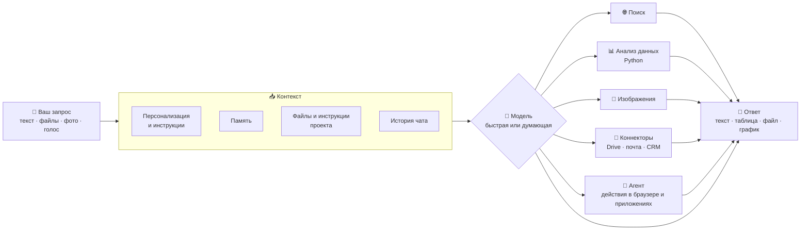
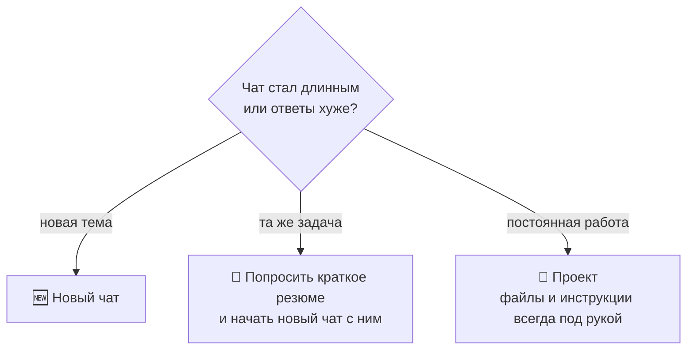
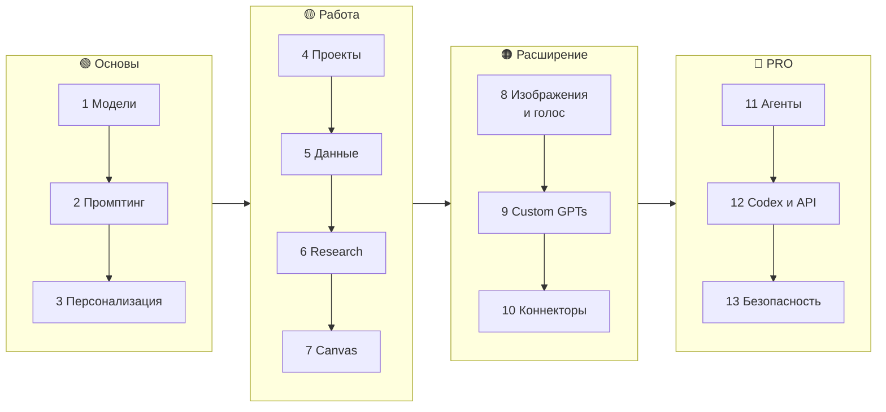
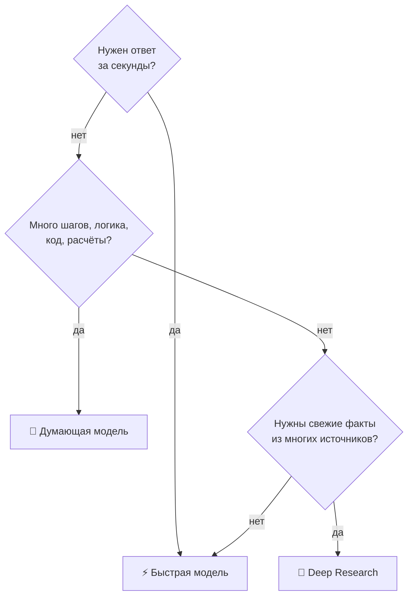
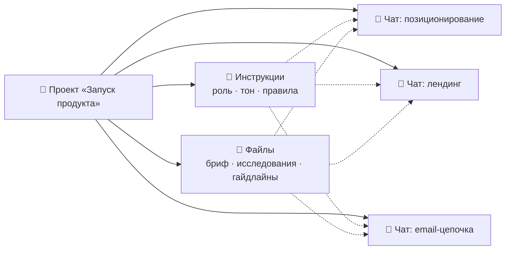
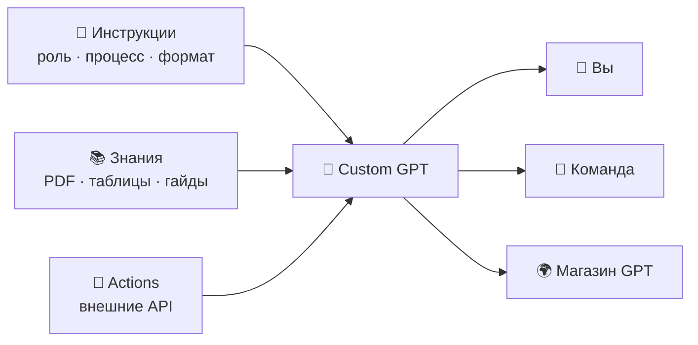
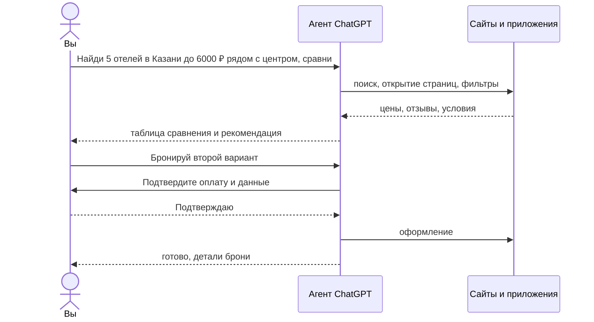
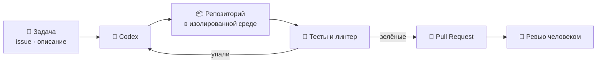

# ChatGPT PRO — полный курс на русском

> Практический курс по **ChatGPT**: от первого промпта до агентов, Custom GPTs, Deep Research, проектов, коннекторов и Codex.
> Схемы, готовые промпты, рецепты задач, антипаттерны и чек-листы — всё в одном README. 🧠 **[Machine learning](https://t.me/+PwIsGaFpgjhkNTdi)** — здесь можно найти полный список самых крутых ИИ курсво, чтобы стать гуру ИИ и множество полезных инструментов и уроками работы с ними, абсолютных мастхев!


---

## Содержание

| Старт | Курс | Практика | Справочник |
|---|---|---|---|
| [Быстрый старт](#быстрый-старт-за-5-минут) | [Как устроен ChatGPT](#как-устроен-chatgpt) | [Рецепты задач](#практические-рецепты-задач) | [Шпаргалка](#шпаргалка) |
| [Карта возможностей](#карта-возможностей) | [Маршрут обучения](#маршрут-обучения) | [Антипаттерны](#антипаттерны-и-как-их-исправить) | [Частые проблемы](#частые-проблемы) |
| [Для кого](#для-кого) | [13 модулей](#модуль-1-модели-и-режимы) | [Прогресс](#прогресс) | [Полезные ссылки](#полезные-ссылки) |

## Полезные ресурсы
- 🧠 **[Machine learning](https://t.me/+PwIsGaFpgjhkNTdi)** — ИИ-инструменты для генерации Python кода, умные-агенты и все что нужно знать из области AI.
- 🖥 **[Pythonl](https://t.me/+pwTlhtK8vEY4Mjky)**— с помощью понятных картинок и коротких видео авторы объясняют сложные концепции и учат профессиональному подходу в разработке.
- 🖥 **[Python Интервью](https://t.me/+sTT6sbZubDM2MWEy)** — огромное количество разобранных вопросов с реальных собеседований Python разработчика.
- 📖 **[PythonBooks](https://t.me/+VnfYvBmK_ZM3YzIy)** ([2](https://t.me/+8Dvl5VlUs5NhMTIy)) — мы создали канал с книгами по Linux и залили туда наверное самую большую подборку книг.
- 💼 **[Python Jobs](https://t.me/+eQsE0ZVnmINmNjQy)** — вакансии и подработка для Python разработчиков.
- 🔝 **[А здесь мы собрали](https://t.me/addlist/8vDUwYRGujRmZjFi)** целый кладезь полезных Python ресурсов для прокачки.
- 🔥 **[Больше крутых курсов и полезных ИИ-инструментов](https://t.me/ai_machinelearning_big_data/10997)** — регулярно публикую здесь.
- 📦 **[Harness_ru](https://github.com/justxor/Harness_ru)** — полный курс по Harness 2026 на русском языке: всё, что нужно знать, в одном месте.
- 🤖 **[Claude Code PRO](https://github.com/justxor/claude-code-pro-course)** — полный курс по Claude Code на русском: CLAUDE.md, skills, subagents, hooks, MCP, CI.

## Для кого

- Тем, кто пользуется ChatGPT «как поисковиком» и хочет получать в разы больше пользы.
- Специалистам: маркетологам, аналитикам, менеджерам, юристам, преподавателям — всем, кто работает с текстом и данными.
- Разработчикам, которым нужны Codex, API и автоматизация.
- Командам, которые хотят внедрить ChatGPT в процессы безопасно и системно.

## Быстрый старт за 5 минут

1. **Настройте персонализацию** (*Settings → Personalization*): кто вы, чем занимаетесь, каким должен быть ответ.
2. **Создайте проект** под постоянную задачу (работа, учёба, хобби) и загрузите туда ключевые файлы.
3. **Выберите режим**: быстрый — для простых вопросов, думающий (reasoning) — для анализа, кода и сложных решений.
4. **Пишите промпт по формуле**:

```text
Роль:      Ты — опытный аналитик маркетплейсов.
Задача:    Сравни три ниши для старта продаж.
Контекст:  Бюджет 300 тыс. ₽, склад в Казани, опыта продаж нет.
Формат:    Таблица: ниша · спрос · конкуренция · маржа · риски. Потом вывод в 3 пунктах.
Ограничения: Только проверяемые факты, источники — ссылками. Если данных нет — так и скажи.
```

5. **Итерируйте**: «углуби пункт 2», «сократи вдвое», «найди слабые места в своём ответе».

## Как устроен ChatGPT

ChatGPT собирает **контекст** из нескольких источников, выбирает **инструменты** и только потом отвечает. Чем лучше контекст — тем точнее результат.



### Окно контекста — главный ресурс

Модель «помнит» только то, что поместилось в контекст текущего чата (плюс память и инструкции). Длинный чат с десятком тем — источник путаницы и ошибок.



## Карта возможностей

| Хочу… | Инструмент |
|---|---|
| быстрый ответ, перевод, переписать текст | обычный чат, быстрая модель |
| разобрать сложную задачу, код, математику, стратегию | думающая (reasoning) модель |
| чтобы ChatGPT всегда знал, кто я и как отвечать | персонализация и память |
| вести постоянную задачу с файлами | **проекты** |
| свежие факты со ссылками | поиск |
| большой отчёт по десяткам источников | **Deep Research** |
| посчитать, построить график, почистить таблицу | анализ данных (файлы + Python) |
| писать и редактировать длинный текст или код | Canvas / документы |
| картинку, обложку, инфографику | генерация изображений |
| своего ассистента с инструкциями и базой знаний | **Custom GPT** |
| работу с почтой, диском, календарём, CRM | коннекторы и приложения |
| чтобы ChatGPT сам выполнил многошаговое действие | **агентный режим** |
| писать и ревьюить код в репозитории | **Codex** |
| встроить модель в свой продукт | OpenAI API |

## Маршрут обучения



---

## Модуль 1. Модели и режимы

В ChatGPT обычно есть **быстрые** модели (мгновенный ответ) и **думающие** (reasoning: модель сначала рассуждает, потом отвечает). Названия и лимиты меняются часто — актуальный список смотрите в выборе модели и в [release notes](https://help.openai.com/en/articles/6825453-chatgpt-release-notes).



**Практика:** задайте одну и ту же сложную задачу быстрой и думающей модели и сравните глубину ответа и время.

## Модуль 2. Промптинг

**Формула:** роль + задача + контекст + формат + ограничения + примеры.

| ❌ Размыто | ✅ Конкретно |
|---|---|
| «Напиши пост про наш продукт» | «Пост для Telegram, 600 знаков, для владельцев кофеен. Продукт — касса с учётом остатков. Тон — дружеский, без канцелярита. В конце — вопрос к аудитории. Дай 3 варианта.» |
| «Сделай резюме документа» | «Сожми договор до 10 пунктов: стороны, сроки, деньги, штрафы, риски для нас. Риски отметь ⚠️. Цитируй номер пункта.» |
| «Помоги с Excel» | «В файле продажи по дням. Найди 3 главных тренда, построй график по неделям, выдели аномалии. Объясни, как считал.» |

**Приёмы, которые работают:**

- **Примеры (few-shot):** покажите 1–3 образца желаемого результата — это сильнее любых описаний.
- **Разметка:** отделяйте данные от инструкций — `"""текст"""`, `<документ>…</документ>`, заголовки.
- **Пусть спросит:** «Прежде чем отвечать, задай мне до 5 уточняющих вопросов».
- **Самопроверка:** «Найди 3 слабых места в своём ответе и исправь их».
- **Декомпозиция:** большую задачу — по шагам в разных сообщениях: план → черновик → правка.
- **Роль критика:** «Ты — придирчивый редактор/инвестор/юрист. Разнеси этот текст».
- **Шаблоны:** сохраняйте удачные промпты — в проектах, Custom GPT или заметках.

## Модуль 3. Персонализация и память

| Механизм | Что хранит | Когда использовать |
|---|---|---|
| **Персонализация** (custom instructions) | кто вы и как отвечать — для всех чатов | стиль, язык, формат, профессия |
| **Память** | факты, которые ChatGPT запомнил из диалогов | предпочтения, контекст о вас и проектах |
| **Инструкции проекта** | правила только для чатов этого проекта | клиент, продукт, курс, исследование |
| **Временный чат** | ничего не запоминает | чувствительные или разовые вопросы |

Пример персонализации:

```text
Я продакт-менеджер в B2B SaaS. Отвечай по-русски, коротко и по делу.
Сначала вывод, потом детали. Таблицы — где сравнение.
Не выдумывай факты: если не уверен — скажи и предложи, как проверить.
Без воды, извинений и фраз «отличный вопрос».
```

**Совет:** периодически открывайте *Settings → Personalization → Memory* и удаляйте устаревшее — неверная память портит ответы.

## Модуль 4. Проекты

Проект — это папка с чатами, файлами и своими инструкциями. Всё, что лежит в проекте, ChatGPT учитывает в каждом его чате.



**Правило:** одна постоянная задача — один проект. Разовые вопросы — в обычном чате.

## Модуль 5. Файлы и анализ данных

ChatGPT умеет читать PDF, документы, таблицы, изображения и запускать Python для расчётов и графиков.

- Загружайте CSV/XLSX и просите: «опиши структуру данных», «найди аномалии», «построй график», «сделай сводную таблицу».
- Просите **показать код и шаги** — так легче проверить расчёт.
- Результат можно скачать: очищенную таблицу, график, отчёт.
- Для больших PDF: сначала «сделай оглавление», потом вопросы по разделам.

```text
[прикреплён файл sales_2026.xlsx]
1) Опиши колонки и проверь данные на пропуски и дубли.
2) Посчитай выручку по месяцам и категориям, построй график.
3) Найди 3 инсайта и 2 аномалии. Для каждого — как проверить.
4) Отдай очищенный файл и график PNG.
```

## Модуль 6. Поиск и Deep Research

| | Поиск | Deep Research |
|---|---|---|
| Время | секунды | минуты |
| Источники | несколько | десятки, с анализом |
| Результат | ответ со ссылками | структурированный отчёт |
| Когда | факты, новости, цены | рынок, конкуренты, обзор литературы, due diligence |

Хороший запрос для Deep Research: **вопрос + рамки + формат отчёта + критерии источников**:

```text
Исследуй рынок онлайн-школ программирования в России за 2024–2026.
Нужно: размер рынка, топ-10 игроков, модели монетизации, средний чек, тренды.
Источники: отчёты аналитиков, публичная отчётность, СМИ. Без блогов-однодневок.
Формат: отчёт с таблицами и ссылками, в конце — 5 возможностей для нового игрока.
```

**Всегда проверяйте ключевые цифры по ссылкам** — модель может ошибиться в интерпретации.

## Модуль 7. Canvas и работа с документами

Canvas (и совместные документы) — редактор рядом с чатом: текст или код открываются отдельно, их можно править точечно.

- Выделите фрагмент → «перепиши проще», «добавь пример», «проверь факты».
- Просите правки уровнем: «сократи на 30%», «сделай тон официальнее», «адаптируй для школьников».
- Для кода — «добавь комментарии», «найди баги», «переведи на другой язык».

## Модуль 8. Изображения и голос

**Изображения.** Описывайте как арт-директор: объект, композиция, стиль, свет, палитра, формат, текст на картинке.

```text
Обложка для YouTube 16:9: разработчик за ноутбуком, неоновая подсветка,
крупная надпись «ChatGPT за 10 минут», контрастные цвета, без мелких деталей.
```

Правки — итеративно: «то же, но фон светлее», «убери текст», «сделай в стиле плоской иллюстрации».

**Голос.** Удобен для практики языков, собеседований, мозговых штурмов на ходу. Приём: «Проведи со мной mock-интервью на позицию Python-разработчика, задавай по одному вопросу и давай фидбек».

## Модуль 9. Custom GPTs

Custom GPT — ваш ассистент с инструкциями, файлами знаний и (опционально) действиями через API.



**Шаблон инструкций:**

```text
Ты — ассистент отдела продаж компании X.
Задача: готовить коммерческие предложения по брифу клиента.
Процесс:
1. Если в брифе не хватает данных — задай уточняющие вопросы (не больше 5).
2. Используй цены и кейсы только из файлов знаний. Ничего не выдумывай.
3. Структура КП: проблема клиента → решение → кейс → цена → следующий шаг.
Формат: деловой тон, до 1 страницы, без жаргона.
```

## Модуль 10. Коннекторы и приложения

Коннекторы подключают ChatGPT к вашим данным и сервисам: облачные диски, почта, календарь, CRM, таск-трекеры и другие. Набор зависит от тарифа и региона.

- «Найди в моём Google Drive последнюю версию договора с X и выпиши сроки».
- «Собери из почты за неделю все письма от клиентов с жалобами и сгруппируй по темам».
- **Подключайте только нужное** и проверяйте, какие данные доступны ChatGPT.

## Модуль 11. Агенты

Агентный режим даёт ChatGPT свой «компьютер»: он сам открывает сайты, кликает, заполняет формы, работает с файлами и приложениями, а вы наблюдаете и подтверждаете важные шаги. В 2026 году OpenAI развивает это направление и в виде долгоживущих агентов, которые ведут работу между чатами — смотрите актуальные возможности в release notes.



**Правила работы с агентом:**

- ставьте задачу с критериями успеха и ограничениями (бюджет, сроки, «ничего не покупать без подтверждения»);
- следите за важными шагами: оплата, отправка писем, удаление;
- не давайте агенту доступ к тому, что не нужно для задачи;
- помните о промпт-инъекциях: текст на сайтах — это данные, а не команды.

## Модуль 12. Codex и API для разработчиков

**Codex** — агент для программирования: читает репозиторий, пишет код, запускает тесты, делает ревью и готовит PR. Работает в облаке, в IDE и в терминале.



Советы:

- держите в репозитории `AGENTS.md`: как собрать, как тестировать, стиль кода — Codex читает его как инструкцию;
- формулируйте задачу как хороший issue: что, где, критерии готовности;
- запускайте несколько вариантов решения и выбирайте лучший;
- **всегда ревьюйте diff** перед мержем.

**OpenAI API** — для встраивания моделей в свои продукты:

```python
from openai import OpenAI

client = OpenAI()  # ключ берётся из переменной окружения OPENAI_API_KEY
response = client.responses.create(
    model="<актуальная-модель>",  # список моделей: platform.openai.com/docs/models
    input="Сделай краткое резюме: ..."
)
print(response.output_text)
```

## Модуль 13. Безопасность и приватность

- **Не загружайте** пароли, ключи API, паспортные данные, коммерческую тайну без разрешения компании.
- Для чувствительных разговоров — **временный чат**; проверьте настройки использования данных для обучения (*Settings → Data controls*).
- Для команд — бизнес-тарифы с админкой и политиками данных.
- **Проверяйте факты**: модель может уверенно ошибаться. Цифры, законы, медицина, финансы — только с проверкой по первоисточнику.
- **Промпт-инъекции**: файлы, письма и сайты могут содержать скрытые «инструкции» для модели. Особенно важно для агентов и коннекторов.
- Решения с последствиями (деньги, здоровье, право) — принимает человек.

---

## Практические рецепты задач

Готовые промпты — копируйте и подставляйте своё в `[квадратные скобки]`.

<details>
<summary><b>📧 Деловое письмо</b></summary>

```text
Напиши письмо поставщику: поставка задержана на 2 недели, нам нужна
компенсация или ускорение. Тон — твёрдый, но вежливый. 150 слов.
Дай 2 варианта: мягкий и жёсткий.
```

</details>

<details>
<summary><b>📄 Разбор договора</b></summary>

```text
[прикреплён договор] Выдели: стороны, предмет, сроки, деньги, штрафы,
условия расторжения. Отдельно — 5 рисков для нас со ссылкой на пункт.
Это не юридическая консультация — отметь, что стоит проверить юристу.
```

</details>

<details>
<summary><b>📊 Анализ таблицы</b></summary>

```text
[прикреплён файл] Опиши данные, почисти дубли и пропуски,
посчитай ключевые метрики по месяцам, построй 2 графика.
В конце — 3 вывода для руководителя простым языком.
```

</details>

<details>
<summary><b>🎯 Стратегия и решения</b></summary>

```text
Я выбираю между A и B: [описание]. Составь таблицу: плюсы, минусы,
риски, стоимость, обратимость. Затем выступи адвокатом дьявола для
каждого варианта. В конце — какие данные помогли бы решить точнее.
```

</details>

<details>
<summary><b>📚 Изучить новую тему</b></summary>

```text
Объясни [тема] так, чтобы я понял за 20 минут.
Сначала аналогия из жизни, потом суть, потом 3 частые ошибки.
В конце — 5 вопросов, чтобы проверить себя. Отвечать буду по одному.
```

</details>

<details>
<summary><b>🗣 Подготовка к собеседованию</b></summary>

```text
Вот вакансия: [текст]. Вот моё резюме: [текст].
Проведи mock-интервью: по одному вопросу, после ответа — оценка 1–10
и как ответить сильнее. 8 вопросов: hard, soft, кейс.
```

</details>

<details>
<summary><b>✍️ Контент-план</b></summary>

```text
Сделай контент-план Telegram-канала про [ниша] на 4 недели, 3 поста в неделю.
Таблица: дата · тема · формат · хук · цель (охват/доверие/продажа).
Учти, что аудитория — [описание].
```

</details>

<details>
<summary><b>🔎 Конкурентный анализ</b></summary>

```text
Deep Research: сравни 5 главных конкурентов [продукт] в [регион].
Цены, ключевые функции, позиционирование, отзывы, слабые места.
Таблица + 5 идей, как нам отстроиться. Все факты — со ссылками.
```

</details>

<details>
<summary><b>🧑‍💻 Разбор ошибки в коде</b></summary>

```text
Вот код и ошибка: [код] [трейсбек].
1) Объясни причину простыми словами.
2) Дай минимальное исправление.
3) Подскажи, как написать тест, чтобы это не повторилось.
```

</details>

<details>
<summary><b>🛒 Описание товара</b></summary>

```text
Сделай описание товара для маркетплейса: [характеристики].
Заголовок до 60 символов с ключевыми словами, 5 буллетов выгод,
описание 800 знаков, без запрещённых площадкой слов. Дай 2 варианта.
```

</details>

<details>
<summary><b>🗂 Протокол встречи</b></summary>

```text
[расшифровка встречи] Сделай протокол: решения, задачи
(кто · что · срок), открытые вопросы. Затем — короткое письмо участникам
с итогами.
```

</details>

<details>
<summary><b>🌍 Перевод с адаптацией</b></summary>

```text
Переведи текст на английский для американской аудитории.
Не дословно: адаптируй идиомы, примеры и тон под маркетинговый лендинг.
Отдельно перечисли места, где пришлось сильно отойти от оригинала.
```

</details>

<details>
<summary><b>🧮 Финансовая модель</b></summary>

```text
Помоги собрать юнит-экономику для [бизнес]: CAC, LTV, маржа,
точка безубыточности. Задай вопросы о недостающих цифрах,
потом посчитай в таблице и отдай XLSX. Покажи формулы.
```

</details>

<details>
<summary><b>🎨 Визуал для поста</b></summary>

```text
Сгенерируй иллюстрацию к посту про [тема]: минимализм, 2–3 цвета
бренда [цвета], формат 1:1, без текста на картинке.
Дай 3 разных концепции на выбор.
```

</details>

<details>
<summary><b>🧠 Мозговой штурм</b></summary>

```text
Придумай 20 идей [задача]. Затем оцени каждую по шкале
влияние × простота, выбери топ-3 и распиши для них первые шаги
на неделю.
```

</details>

## Антипаттерны и как их исправить

| ❌ Ошибка | Почему плохо | ✅ Как правильно |
|---|---|---|
| Один бесконечный чат на все темы | контекст смешивается, качество падает | новый чат на тему, проекты для постоянных задач |
| «Напиши что-нибудь про…» | получаете средний шаблонный текст | формула: роль, задача, контекст, формат, ограничения |
| Принимать цифры и факты на веру | модель может ошибаться уверенно | просить источники и проверять ключевое |
| Переписывать промпт с нуля после неудачи | теряется найденное | итерировать: «что не так в ответе» и точечные правки |
| Всё в одном огромном промпте | модель теряет часть требований | декомпозиция: план → черновик → правка |
| Загружать секреты и персональные данные | риски утечки и нарушения политик | обезличивать, временный чат, бизнес-тариф |
| Агенту — «сделай всё сам» без границ | лишние действия, траты | критерии успеха, лимиты, подтверждение важных шагов |
| Не настраивать персонализацию | каждый раз объяснять одно и то же | 5 строк о себе и формате один раз |

## Частые проблемы

| Симптом | Что сделать |
|---|---|
| Ответы общие и «водянистые» | дайте контекст, примеры и формат; запретите воду явно |
| ChatGPT «забыл» условия | перенесите их в инструкции проекта или начните новый чат с резюме |
| Выдумывает факты и ссылки | включите поиск, просите цитаты и ссылки, проверяйте |
| Игнорирует часть требований | нумеруйте требования, просите в конце чек-лист выполнения |
| Слишком длинно | задайте лимит: «до 150 слов», «5 пунктов» |
| Ошибается в расчётах | просите считать через анализ данных и показать код |
| Устаревшая или неверная память | почистите память в настройках |

## Шпаргалка

| Приём | Фраза |
|---|---|
| Уточнения | «Прежде чем отвечать, задай до 5 вопросов» |
| Самопроверка | «Проверь свой ответ: найди 3 ошибки и исправь» |
| Формат | «Ответ — таблица, потом вывод в 3 пунктах» |
| Длина | «Не больше 100 слов» |
| Тон | «Как объяснил бы опытный коллега, без канцелярита» |
| Варианты | «Дай 3 разных варианта: осторожный, смелый, неожиданный» |
| Критика | «Ты — скептичный инвестор. Разнеси эту идею» |
| Упрощение | «Объясни, как 12-летнему, потом — как специалисту» |
| Резюме чата | «Сожми наш диалог в 10 пунктов, чтобы продолжить в новом чате» |
| Честность | «Если не уверен — так и скажи, не выдумывай» |

## Прогресс

Скопируйте в заметки и отмечайте:

```markdown
- [ ] 1 Модели и режимы         - [ ] 8 Изображения и голос
- [ ] 2 Промптинг               - [ ] 9 Custom GPTs
- [ ] 3 Персонализация и память - [ ] 10 Коннекторы
- [ ] 4 Проекты                 - [ ] 11 Агенты
- [ ] 5 Файлы и данные          - [ ] 12 Codex и API
- [ ] 6 Поиск и Deep Research   - [ ] 13 Безопасность
- [ ] 7 Canvas                  - [ ] 5 рецептов на своих задачах
```

## Полезные ссылки

- Release notes ChatGPT: https://help.openai.com/en/articles/6825453-chatgpt-release-notes
- Справочный центр: https://help.openai.com
- Документация API: https://platform.openai.com/docs
- Гайд по промптингу от OpenAI: https://platform.openai.com/docs/guides/prompt-engineering

> ⚠️ ChatGPT обновляется очень быстро: названия моделей, лимиты и функции меняются. Если что-то устарело — [откройте issue](https://github.com/justxor/ChatGPT_ru/issues/new).

⭐ Если курс полезен — поставьте звезду репозиторию, это помогает другим его найти.
